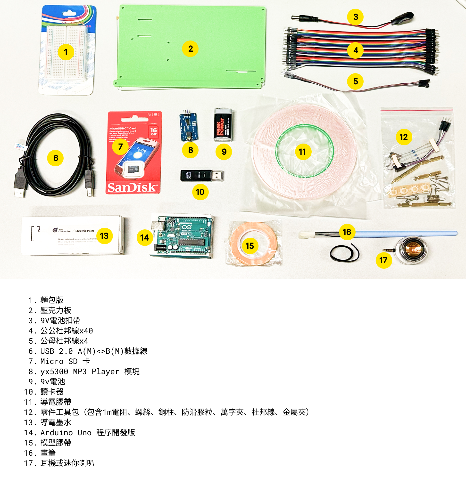

<a name="readme-top"></a>

<h1 align="center">🎵 DrawSound ｜電・紙樂器 🎵</h1>
<p align="center">🎨💻 用導電墨水將畫作變成電子樂器（聲音藝術互動裝置）</p>
<p align="center">👨‍🏫 導師: Andio Lai</p>


  <summary>📖 目錄</summary>
  <ol>
    <li> 
      <a href="#課程介紹"> 課程介紹</a>
    </li>
    <li>
      <a href="#課前準備"> 課前準備</a>
      <ul>
        <li><a href="#下載軟件">下載軟件</a></li>
        <li><a href="#認識硬件包">認識硬件包</a></li>
      </ul>
    </li>
    <li><a href="#lesson-1">Lesson 1</a></li>
    <li><a href="#lesson-2">Lesson 2</a></li>
    <li><a href="#lesson-3">Lesson 3</a></li>
    <li><a href="#review">Review</a></li>
    <li><a href="#聯繫我們">需要幫助？聯繫我們</a></li>
  </ol>


## 課程介紹
🧠
由聲音、新媒體藝術家 黎仲民Andio Lai 帶領同學學習不同 Software、Hardware的操作，將畫作變成電子樂器，從中學習到：
1. 電子聲音創作平台 Ableton Learning Synths、Audacity和Arduino 軟硬件的運用
2. 繪畫互動介面：利用導電媒體（如conductive ink），創作出觸控式畫作
3. 結合以上技巧，創作出獨一無二的視覺＋聲音藝術作品，並探索利用導電媒體創作共融藝術的可能性。

<p align="right">(<a href="#readme-top">back to top</a>)</p>

## 課前準備
我們需要Software、Hardware的結合，才能完成本課程的藝術創作。在開始創作前，我們需要下載軟件和準備好電子零件和工具。

### 下載軟件
1. 首先我們先去Arduino官網下載Arduino IDE (建議使用Legacy IDE (1.8.X) 1.8.19版本): https://www.arduino.cc/en/software 

❓什麼是Arduino：

Arduino是一款便捷靈活、方便上手的開源電子原型平台。包含硬件（各種型號的Arduino板）和軟件（ArduinoIDE）。由一個歐洲開發團隊於2005年冬季開發。

2. 下一步，我們去Audacity官網下載最新版本的Audacity: https://www.audacityteam.org/download/

❓什麼是Audacity：

Audacity是一款跨平台的音频编辑软件，用於錄音和編輯音訊，是自由、開放原始碼的軟體。這個程式可用於剪輯音樂、合併音樂、錄音、去除人聲、去除雜音等等。

### 認識硬件包
我們團隊準備好了創作本作品所需要的工具和電子元件，我們一起來認識一下吧！



<p align="right">(<a href="#readme-top">back to top</a>)</p>

## Lesson 1
下面我們開始真正的課程學習！

在本課程中，你將學習到關於合成器（Synthesizer或Synth）的基礎知識，並使用Audacity設計自己的聲音。

1. 打開下面的網址，開始音樂創作： 網絡App Web App - 合成器音樂 Synth Music -Ableton Learn Synth: https://learningsynths.ableton.com/en/playground

2. 將製作好的聲音下載到本地文件夾裡，再使用Audacity編輯音訊，如果你不清楚如何使用Audacity，可以先觀看下面的教學視頻：

Audacity Tutorial For Beginners by Mike Russell
https://www.youtube.com/watch?v=vlzOb4OLj94


3. 聲音創作完成後，記得將聲音儲存為wav格式，重命名為001（如果你有多於1首歌，那就按照順序重新命名：001、002、003......），並將文件儲存在一個新的文件夾裡，文件夾重命名為01。在工具包裡找到micro sd卡和讀卡器，將這個01文件夾儲存到卡裏。


<p align="right">(<a href="#readme-top">back to top</a>)</p>

## Lesson 2

聲音製作完成後，我們開始製作繪畫互動介面：利用導電媒體（如導電墨水、導電膠帶），創作出觸控式畫作。

電路連接手冊 Connection Manual：[connection manual.pdf](https://github.com/nixhehehe/testing1/files/10908029/connection.manual.pdf)
<p align="right">(<a href="#readme-top">back to top</a>)</p>

## Lesson 3

組裝指南 Assembly Guide：
[revised.guide.lesson3.pdf](https://github.com/nixhehehe/testing1/files/10908037/revised.guide.lesson3.pdf)

現在我們打開已經下載好的Arduino IDE (1.8.19)軟件，為軟件安裝兩個編碼庫：SerialMP3、CapacitiveSensor


如何加入編碼庫 How to add library? 
[library.pdf](https://github.com/nixhehehe/testing1/files/10908040/library.pdf)

接下來我們把鼠標放到下面的代碼欄，點擊右上角的複製按鈕，就可以直接複製下面的代碼啦，然後再把代碼粘貼到Arduino IDE內。（記得刪除Arduino IDE初始自帶的代碼）


```sh
#include "SerialMP3Player.h"// 使用MP3版的編碼庫library

#include <CapacitiveSensor.h>// 使用可感應導電墨水的CAP SENSE編碼庫library

#define TX 11 //to MP3 board RX //定義ARDUINO TX到MP3 RX引腳連接
#define RX 10 //to MP3 board TX //定義ARDUINO RX到MP3 TX引腳連接

SerialMP3Player mp3(RX, TX);// 定義起動MP3相關的TX， RX

CapacitiveSensor sensor1 = CapacitiveSensor(4, 2); 
//定義CAP SENSE導電感應引腳連接，兩者使用ARDUINO的DIGITAL引腳，並配合電阻達到感應運作 
//前者為SEND PIN,後者為RECIEVE PIN要連接到紙上


//設定：有電源起動時執行一次的程序
void setup() {
  Serial.begin(9600);     // 起動serial介面
  mp3.begin(9600);        // 開始MP3版的連接
  delay(500);             // 等待起動
  mp3.sendCommand(CMD_SEL_DEV, 0, 2);   //選取 sd-card
  delay(500);             // 等待起動
  mp3.setVol(15);// 設定音量
}

//迴圈: 處理器不停執行的程序

void loop() {

  long measurement =  sensor1.capacitiveSensor(10);//讀取SENSOR的數值

  Serial.print(measurement);//SERIAL PRINT SENSOR的數值以方便MAPPING
  Serial.println("\t");

if (measurement >= 400){//決定觸發起動歌曲的條件(值)
    mp3.play(1);     //歌曲於SD CARD內的次序
  }
  
  delay(50);//迴圈再執行的中間位
}
   ```

<p align="right">(<a href="#readme-top">back to top</a>)</p>

## Review

## 聯繫我們
如果你在學習本課程中遇到問題，歡迎聯繫我們！


